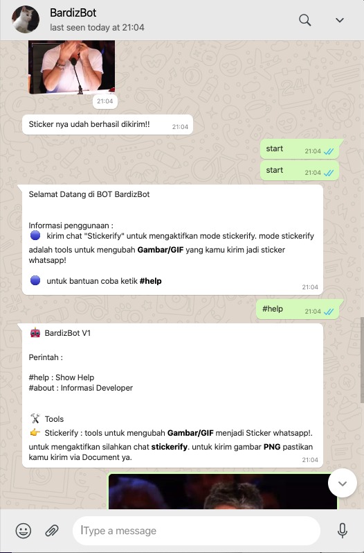

# bot-sticker-whatsapp
Bot Sticker Buat Whatsapp

# instalation
1. follow the instruction on this repo : https://github.com/open-wa/wa-automate-nodejs
2. install pm2
```
npm install pm2@latest -g
```
3. install all dependencies
```
npm install
```
4. create .env file
```
cp .env.exampe .env
```
5. edit .env file
```
BOT_NAME=BardizBot
BOT_START_TERM=start
BOT_INTERNAL_HANDLER=true
BOT_EXTERNAL_HANDLER=true
BOT_IDENTIFIER=BardizBotWA

API_WEBHOOK=http://127.0.0.1:8081/webhook

DB_NAME="wa-bot"

ADMIN_NUMBER=6281414015xxxxx #mandatory
``` 


# usage 
1. First time run :
```
node index.js
```
2. scan QRCode using whatsapp on your phone
3. CTRL + C to close the server
4. run index.js using pm2
```
pm2 start index.js
```

# screenshot
